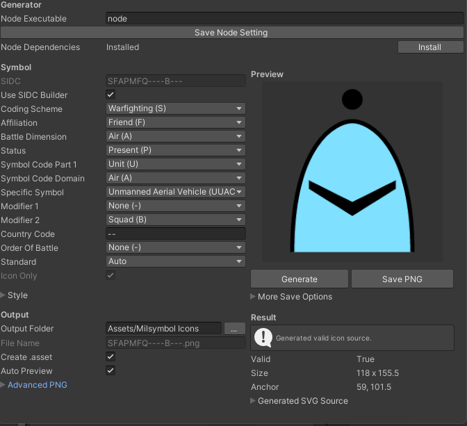

# Milsymbol Unity

This package wraps the JavaScript `milsymbol` source for Unity editor-time icon generation.



## What is ported

- Runtime request/style/result asset types for military symbol icons.
- An editor window at `Tools/Milsymbol/Icon Generator`.
- A Node-based editor generator that calls the bundled `milsymbol` JavaScript source.
- PNG export with `infoFields=false`, so text labels are not emitted.
- SIDC Builder dropdown workflow plus direct SIDC input.
- Editable generated SVG text in the editor window.
- Local PNG export through `milsymbol`'s Node-side `Symbol.asPNG()` API.
- Auto Preview with debounced generation.
- Context-menu regeneration for `MilsymbolIconAsset`.

## Requirements

- Unity 2021.3 or newer.
- Node.js available as `node`, or a custom executable path entered in the generator window.
- Install Node dependencies from Unity with `Tools/Milsymbol/Install Node Dependencies`, or click `Install` in the generator window. PNG export also prompts for this if dependencies are missing. The installer runs `npm install --omit=dev`.

## Installation

Install through Unity Package Manager with this Git URL:

```text
https://github.com/Leuconoe/milsymbol-unity.git
```

If the bundled `milsymbol` submodule is not initialized after installation, run:

```bash
git submodule update --init --recursive
```

## Usage

1. Open `Tools/Milsymbol/Icon Generator`.
2. If `Node Dependencies` shows `Missing`, click `Install`.
3. Build a SIDC with dropdowns, or disable `Use SIDC Builder` and enter one directly.
4. Adjust frame, fill, size, color, Auto Preview, and standard options.
5. Click `Generate` and `Save PNG`.

The saved `.png` is imported into the project as a Sprite texture. The file name is generated from the SIDC, for example `SFAPMFQ----B---.png`. A `Milsymbol Icons.spriteatlas` file is created in the output folder and the output folder is registered as its packable; saved PNG files are not registered one by one. If `Create .asset` is enabled, a `MilsymbolIconAsset` is saved next to the PNG with the SIDC, style options, PNG texture reference, SVG source, size, anchor, and validity flag.

The editor defaults to the letter SIDC format used by MIL-STD-2525B/C and APP-6B/C style symbols. `Generate` updates the SVG source metadata, and `Save PNG` asks the bundled `milsymbol` Node code to export a PNG directly into the package output folder. `Save PNG As Local File...` writes a PNG to any local path.

To regenerate an existing `MilsymbolIconAsset`, right-click it and choose `Milsymbol/Regenerate Icon`. Regeneration overwrites the existing linked PNG when one is available.

## Icon-only behavior

The editor always sends `iconOnly=true` to the generator. The Node bridge maps that to `milsymbol` option `infoFields=false`, which removes text fields and information-field graphics while keeping the frame, fill, core icon, and graphical symbol modifiers.
